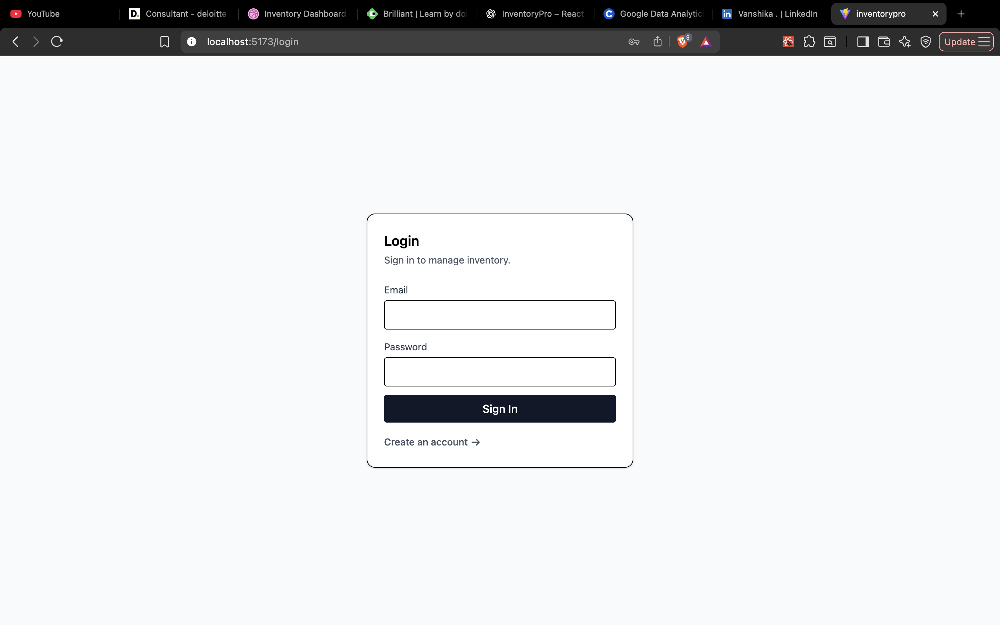
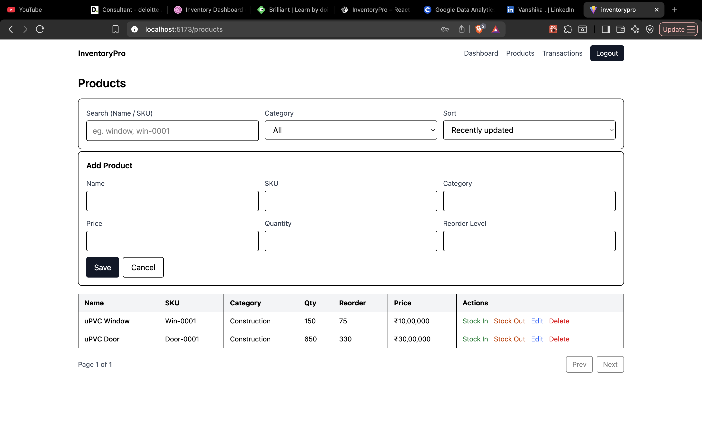
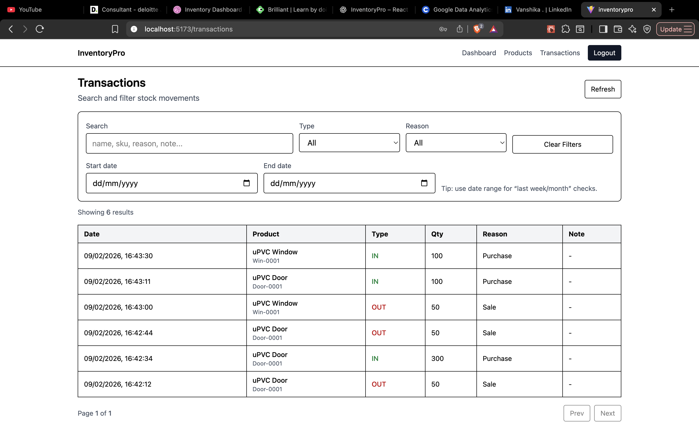

# InventoryPro – Inventory Management Dashboard

InventoryPro is a real-world inventory management dashboard built for small retail businesses to manage products, track stock movement, monitor low-stock items, and maintain transaction history in a clean and secure interface.

This project is designed as a resume-ready full-stack application using React and Firebase, with practical business logic and production-style architecture.

---

## Live Purpose

Small retail businesses often manage inventory manually using notebooks, spreadsheets, or memory. This leads to:

- inaccurate stock tracking
- delayed restocking
- no proper transaction records
- no visibility into current inventory health

InventoryPro solves this by providing a centralized system for:

- product management
- stock in / stock out tracking
- transaction audit trail
- dashboard insights
- user-based protected access

---

## Features

### Authentication
- Email/password login
- Signup for authorized users
- Protected routes
- Session persistence using Firebase Authentication

### Product Management
- Add new products
- Edit product details
- Delete discontinued products
- SKU uniqueness validation
- Category-based organization

### Inventory Operations
- Stock In
- Stock Out
- Prevent negative stock
- Automatic quantity updates

### Transactions
- Immutable stock movement log
- Search transactions
- Filter by type, reason, and date range
- Paginated transaction history

### Dashboard
- Total number of products
- Total stock units
- Inventory value
- Out-of-stock count
- Low-stock alerts
- Recent activity feed

### Security
- Firebase Authentication-based access
- Firestore security rules
- Per-user ownership isolation using `ownerId`
- Users can only access their own products and transactions

---

## Tech Stack

- **Frontend:** React.js (Vite)
- **Styling:** Tailwind CSS
- **Backend / Database:** Firebase Firestore
- **Authentication:** Firebase Authentication
- **Language:** JavaScript
- **State Management:** Context API

---

## Folder Structure

```bash
src/
├── app/
│   ├── App.jsx
│   └── main.jsx
│
├── components/
│   ├── common/
│   ├── dashboard/
│   ├── products/
│   └── transactions/
│
├── context/
│   └── AuthContext.jsx
│
├── firebase/
│   ├── firebaseConfig.js
│   ├── firestoreServices.js
│   └── dashboardServices.js
│
├── pages/
│   ├── Dashboard.jsx
│   ├── Login.jsx
│   ├── Products.jsx
│   ├── Signup.jsx
│   └── Transactions.jsx
│
├── routes/
│   └── ProtectedRoute.jsx
│
├── utils/
│   ├── productHelpers.js
│   └── transactionHelpers.js
│
└── index.css

Firestore Data Model

products
Each product document stores:
 - ownerId
 - name
 - sku
 - category
 - price
 - quantity
 - reorderLevel
 - createdAt
 - updatedAt

transactions
Each transaction document stores:
 - ownerId
 - productId
 - productName
 - sku
 - type (IN / OUT)
 - quantity
 - reason
 - note
 - createdAt
 - createdBy

Security Design
This project uses Firestore rules to ensure each user can only access their own data.

Rule Strategy
 - ownerId is stored on every document
 - reads/writes are allowed only if request.auth.uid === ownerId
This prevents cross-user access and makes the app safer for multi-user scenarios.

Setup Instructions

1. Clone the repository
```Bash
git clone https://github.com/Tushar7564/inventoryPro.git
cd inventorypro
```

2. Install dependencies
```Bash
npm install
```

3. Create environment variables
Create a .env file in the project root:
```env
VITE_FIREBASE_API_KEY=your_api_key
VITE_FIREBASE_AUTH_DOMAIN=your_auth_domain
VITE_FIREBASE_PROJECT_ID=your_project_id
VITE_FIREBASE_STORAGE_BUCKET=your_storage_bucket
VITE_FIREBASE_MESSAGING_SENDER_ID=your_sender_id
VITE_FIREBASE_APP_ID=your_app_id
```

4. Start the development server
```Bash
npm run dev
```

**Firebase Setup**

**Authentication**
Enable the following in Firebase Console:
 - Email/Password Authentication

**Firestore**
Create a Firestore database and configure rules.

**Required Firestore Rules**

```javascript
rules_version = '2';
service cloud.firestore {
  match /databases/{database}/documents {

    function signedIn() {
      return request.auth != null;
    }

    function isOwner() {
      return signedIn() && resource.data.ownerId == request.auth.uid;
    }

    function isCreatingOwnData() {
      return signedIn() && request.resource.data.ownerId == request.auth.uid;
    }

    match /products/{docId} {
      allow create: if isCreatingOwnData();
      allow read, delete: if isOwner();
      allow update: if isOwner()
                    && request.resource.data.ownerId == resource.data.ownerId;
    }

    match /transactions/{docId} {
      allow create: if isCreatingOwnData();
      allow read, delete: if isOwner();
      allow update: if isOwner()
                    && request.resource.data.ownerId == resource.data.ownerId;
    }
  }
}
```

**Firestore Indexes**

This project may require composite indexes for queries combining:
 - ownerId
 - createdAt

Example:
 - Transactions filtered by owner and ordered by latest first

Firebase will automatically provide an index creation link when needed.

**Key Engineering Decisions**

**1. Context API over Redux**
The app only needs lightweight global auth state, so Context API keeps the architecture simple and avoids unnecessary complexity.

**2. Firestore Service Layer**
All Firestore operations are separated into service files, keeping UI components cleaner and making the code easier to maintain.

**3. Atomic Stock Updates**
Stock movement is handled using Firestore transactions to ensure:
 - quantity update and transaction log are written together
 - stock cannot go negative accidentally

**4. Denormalized Transaction Data**
Transaction documents store product name and SKU directly to preserve historical accuracy even if product details change later.

**5. Client-side Search / Filter / Pagination**
For this scale of application, client-side handling keeps the UI responsive and avoids premature over-engineering.

**Current Modules Completed**
 - Module 1: Authentication + Protected Routes
 - Module 2: Product CRUD
 - Module 3: Stock In / Stock Out + Transaction Logging
 - Module 4: Dashboard Stats + Low Stock Alerts
 - Module 5: Products UX Polish (search, filter, sort, pagination, validation)
 - Module 6: Transactions UX (search, filter, date range, pagination)
 - Module 7: Security Hardening with per-user ownership

**Screenshots**

### Login Page


### Dashboard


### Products


### Transactions



**Resume / Interview Value**
 - This project demonstrates:
 - frontend architecture in React
 - Firebase Authentication integration
 - Firestore CRUD operations
 - secure route protection
 - real-world business logic
 - transaction-safe inventory handling
 - dashboard design thinking
 - user-based data security

**Good interview talking points**
 - Why Context API was enough
 - How stock movement was made atomic
 - Why ownerId was added for security
 - Why transaction data was denormalized
 - How low-stock alerts were implemented
 - How Firestore indexes were handled

**Future Improvements**
 - Role-based access (admin / staff)
 - CSV export for reports
 - Dark mode
 - Product image upload
 - Supplier/customer module
 - Monthly analytics charts
 - Inventory valuation trends

**Author**
Tushar
Frontend / Full-Stack Developer
GitHub: https://github.com/Tushar7564
LinkedIn: https://www.linkedin.com/in/tushar-4962891ba/